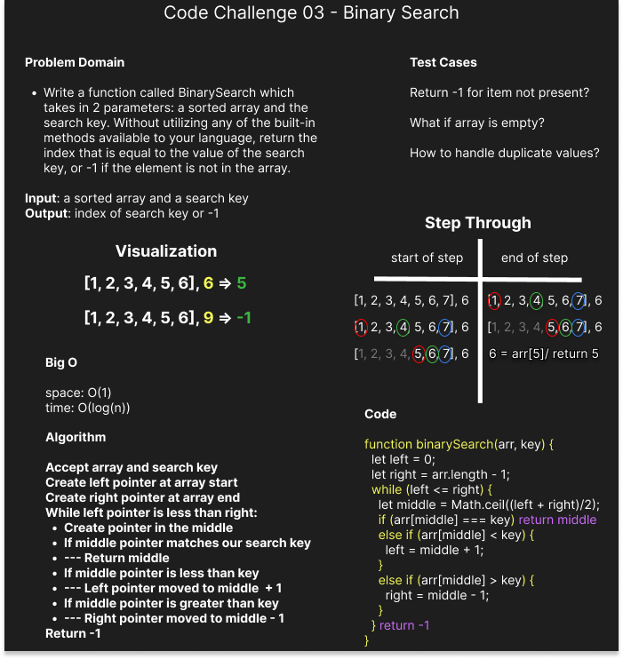

# Whiteboard: Array Binary Search

## Problem Domain

Write a function called BinarySearch which takes in 2 parameters: a sorted array and the search key. Without utilizing any of the built-in methods available to your language, return the index of the array's element that is equal to the value of the search key, or -1 if the element is not in the array.

## Test Cases

- Return -1 for item not present?
- What if the array is empty?
- How to handle duplicate values?

My partner for this assignment was Tyler Bennett.
