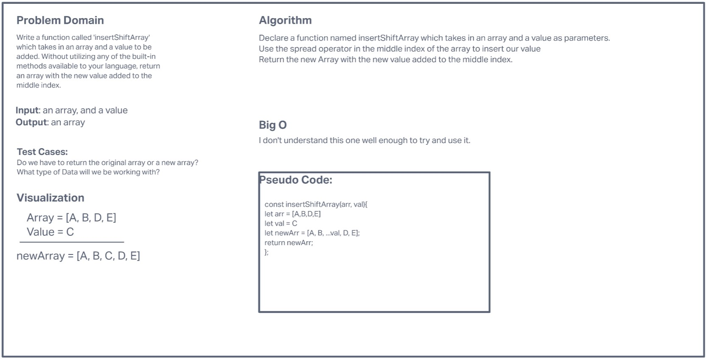

# Whiteboard: Insert Shift Array

## Problem Domain

Write a function called insertShiftArray which takes in an array and a value to be added. Without utilizing any of the built-in methods available to your language, return an array with the new value added at the middle index.

## Test Cases

- Do we have to return the original array or a new array?
- What type of Data will we be working with?

