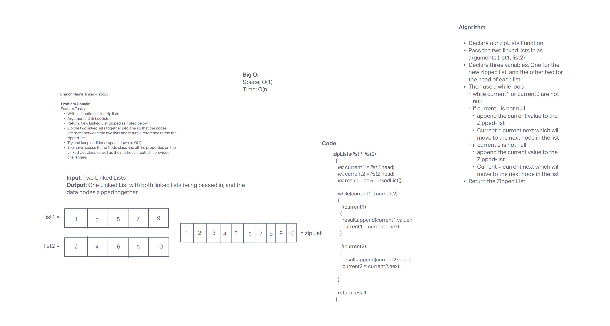
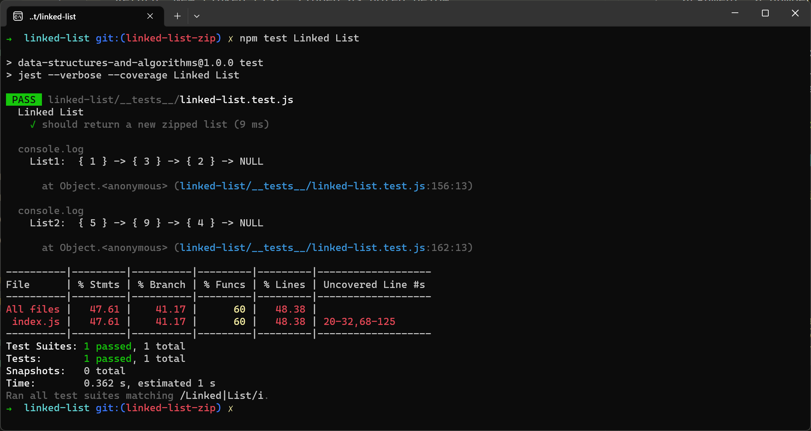

# Linked List Zip

## Challenge Summary

Create a Linked List that will take in two separate lists and combine them in an alternating pattern and return them as a new Zipped List.

## Whiteboard Process

We used Invision to share the Whiteboard between all of us

## Approach & Efficiency

I started with the Visualization, and Marco started with the algorithm. Once I finished the Visualization I joined Marco to try and flush out the algorithm.

## Solution

We used a while loop to make sure we're only using nodes with a value, then we use an if conditional statement to make doubly sure we're not using empty nodes, if the node has a value then it gets appended to the zipped list, then we move onto the next node to check for a value and repeat the process until the lists are empty and we'll have a fully zipped list.