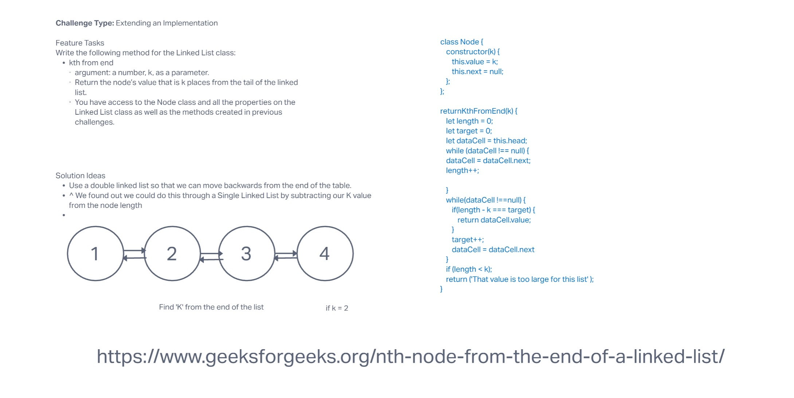

# Code Challenge 06: Linked-List Kth

## Whiteboard Process

* My partner and I worked together on the whiteboard. Unfortunately he had to leave shortly after we started to tend to some personal business, but I wrote the code to get the Linked List to read Nodes from the tail end of the list. I found part of the code online, and I made sure to provide the link to the site as attribution.

