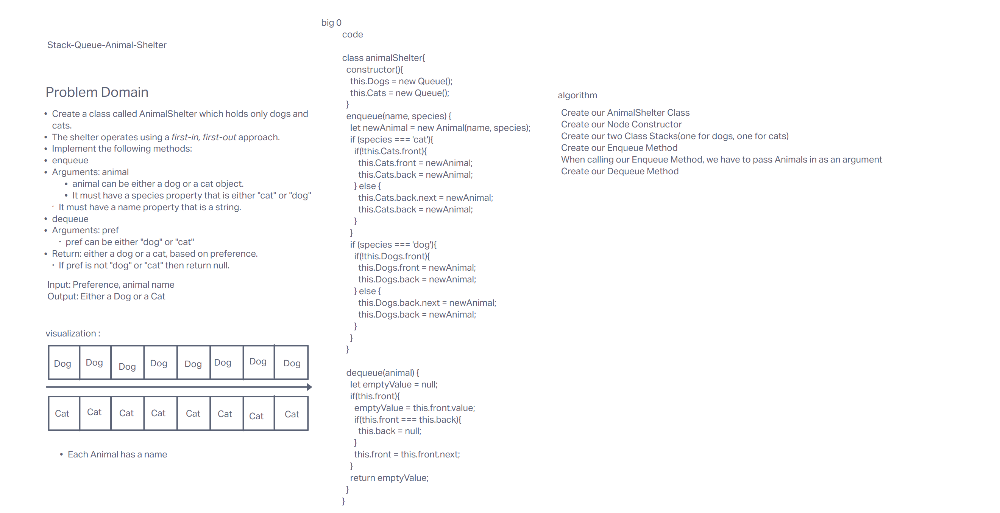

# Challenge Summary

Our challenge was to create an animal shelter class that implements enqueue, and dequeue. We also needed to be able to return the specific animal that was dequeued.

## Whiteboard Process
