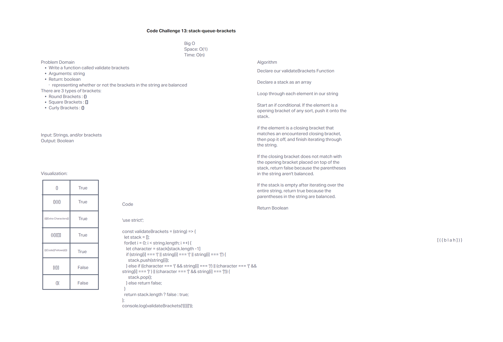

# Whiteboard: Stack-Queue-Brackets

## Problem Domain

Write a function called validate brackets
Arguments: string
Return: boolean
representing whether or not the brackets in the string are balanced
There are 3 types of brackets:

Round Brackets : ()
Square Brackets : []
Curly Brackets : {}

## Whiteboard Process

My partner and I used invision for our whiteboard, and replit for our code. We copy and pasted our code from Replit into our whiteboard.

[Replit](https://replit.com/@Jrc2855/HumiliatingTidyFactors#index.js)

