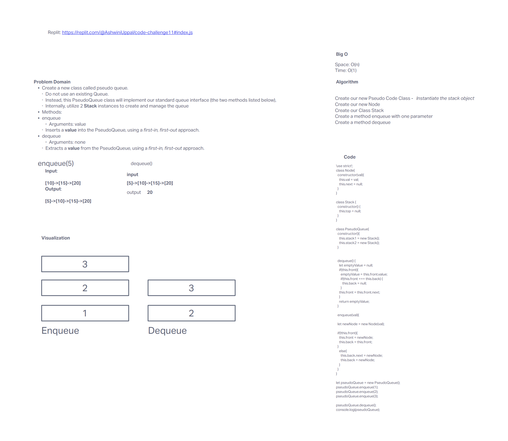

# Challenge Summary

Our challenge was to successfully add and remove something to a Queue following a First in First out format. We needed to create a new class called Pseudo Queue and use two stack instances to manage our Queue.

## Whiteboard Process 
