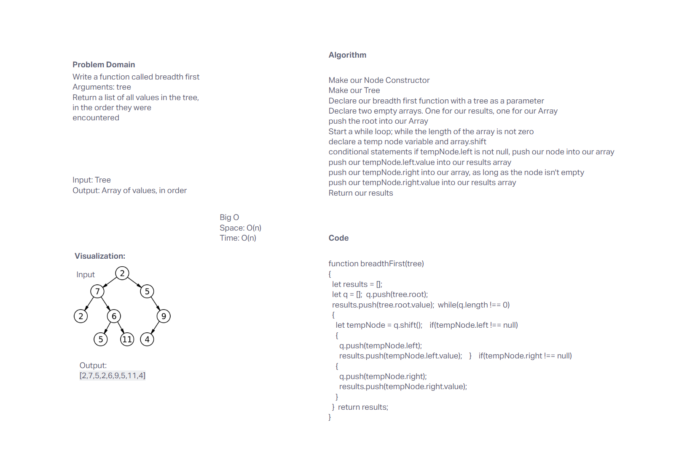

# Whiteboard: Breadth First Tree

## Problem Domain

Write a function called breadth first with the tree as a parameter, and return a list of all values in the tree, in the order they were encountered.

## Attribution
[Attribution](https://www.geeksforgeeks.org/level-order-tree-traversal/)