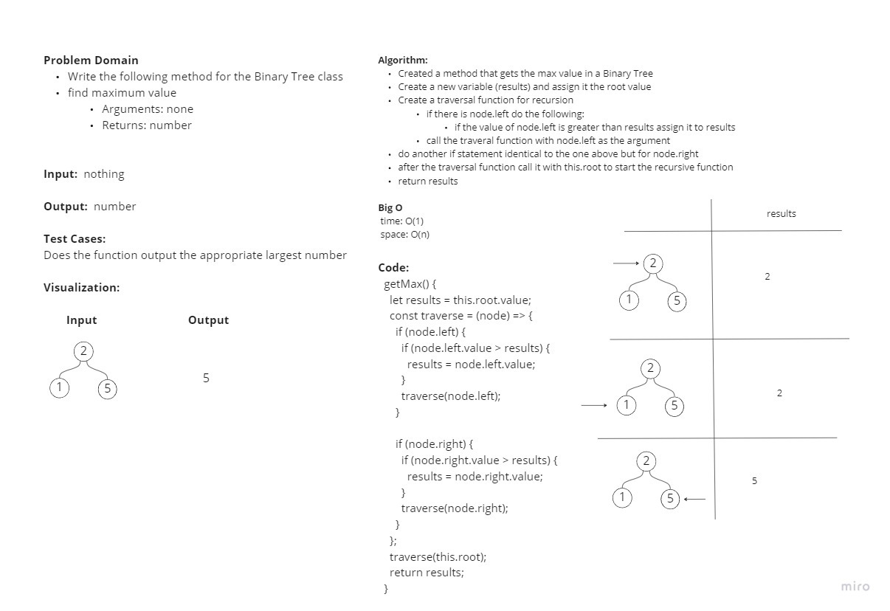

# Code Challenge: Class 16

## Problem Domain

* Write a method for a Binary Tree Class that finds the maximum value.

## Test Cases

* Does the function output the appropriate largest number?
* Will it still work if we throw negative numbers into the tree?

