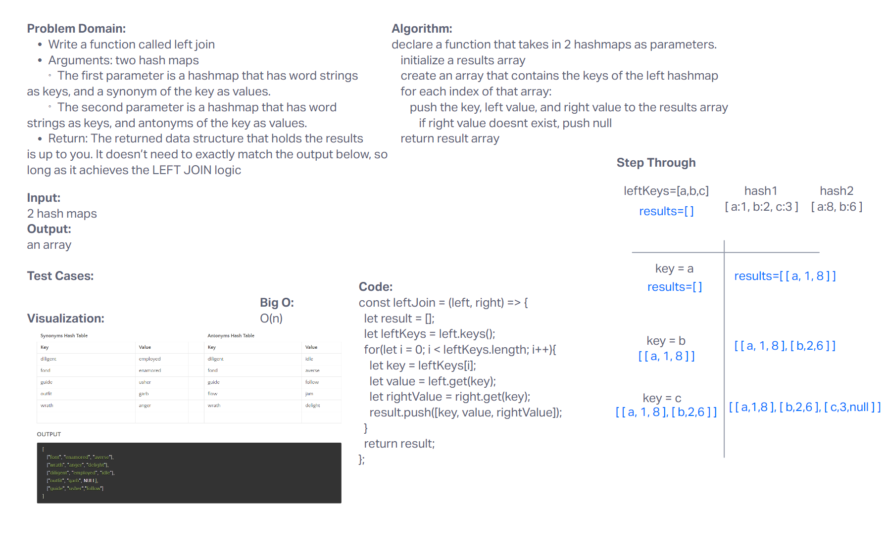

# Challenge Title
Code Challenge 33: Hashmap Left Join

## Whiteboard Process

## Approach & Efficiency
The Time and Space Complexity for our code from today is O(n).

## Solution
We wrote the details of our algorithm in our whiteboard but to summarize we used the keys methods we already had written from a previous lab, and then used an array to hold the keys of our hashmap and pushed the keys into our left value, and the values of the hashmaps were pushed into our results array. 