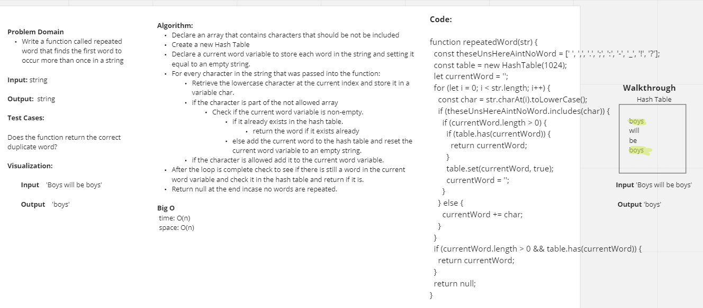

# Challenge Title
Code Challenge 31: Hashmap Repeated Word

## Whiteboard Process

## Approach & Efficiency
The Time and Space Complexity for our code from today is O(n).

## Solution
To Make our solution work, I used a console log within my hashtable.js file to verify proper operation, and unit tests to properly implement TDD.